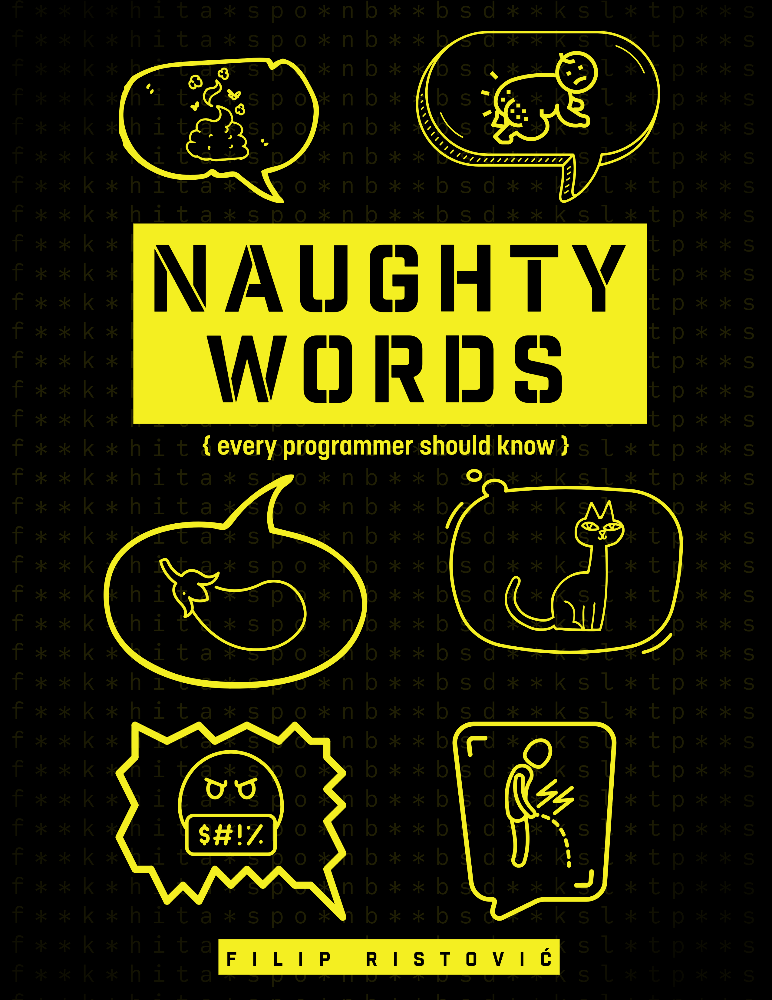

  

# Naughty Words Every Programmer Should Know

**Naughty Words Every Programmer Should Know** rips the plastic wrap off software development’s most overused principles and repackages them as unforgettable, slightly NSFW acronyms you’ll actually remember.

📘 **Free PDF download**  
➡️ [Download the book](./Naughty_Words_Every_Programmer_Should_Know.pdf)

---

## What’s inside?
- No-BS explanations of real engineering principles  
- War stories from actual projects (the kind you don’t hear at conferences)
- Honest takes on why some “best practices” quietly destroy codebases
- Practical advice for writing software that survives contact with reality

---

## Who is this for?
- Junior developers trying to avoid painful rookie mistakes
- Mid-level devs drowning in process theater
- Senior engineers who’ve seen things and are tired of pretending otherwise

---

## Why this book exists
Most programming advice is:
- Over-sanitized
- Over-abstracted
- Under-tested in the real world

This book exists to say the quiet parts out loud — with humor, clarity, and zero corporate polish.

---

## ⚠️⚠️⚠️ Warning
Contains:
- Strong language
- Stronger opinions
- A high chance of spontaneous nodding across your dev team

Read responsibly.

---

## License

This book is free to share under the **Creative Commons BY 4.0** license.  
You’re encouraged to distribute it, quote it, and argue with it — just give credit.
