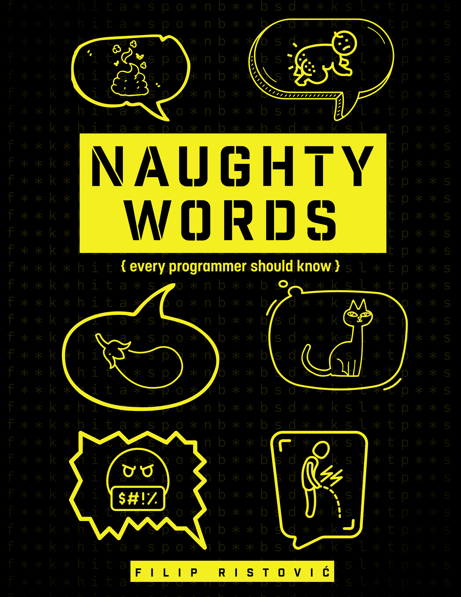
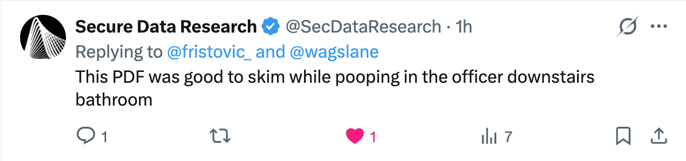
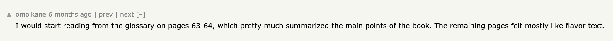

  

# Naughty Words Every Programmer Should Know

**Naughty Words Every Programmer Should Know** rips the plastic wrap off software development’s most overused principles and repackages them as unforgettable, slightly NSFW acronyms you’ll actually remember.

📘 **Download the eBook for FREE**  
➡️ [PDF](./Naughty_Words_Every_Programmer_Should_Know.pdf) | [ePub](./Naughty_Words_Every_Programmer_Should_Know.epub)
---

## What’s inside?
- A good read

## Who is this for?
- Everyone on every level of engineering prowess 

## Why this book exists
- To say how it is with humor, clarity, and zero corporate polish

---

## ⚠️⚠️⚠️ Warning
- A high chance of spontaneous nodding across your dev team

Read responsibly.

---

## Book reviews

### What others said about the book:

  

  

---

## License

This book is free to share under the **Creative Commons BY 4.0** license.  
You’re encouraged to distribute it, quote it, and argue with it — just give credit.
